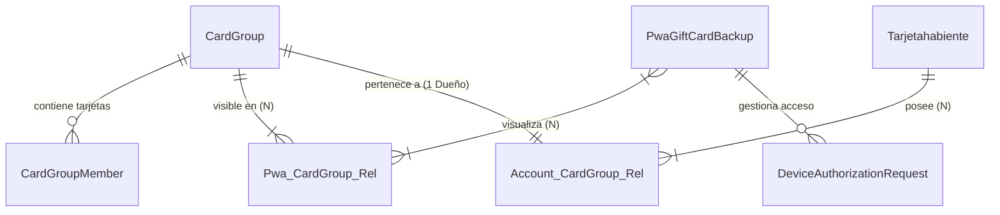

# Propuesta de Arquitectura: Grupos de Tarjetas para PWA (V2)

## Resumen
Arquitectura actualizada para la gestión de tarjetas en PWA, incorporando **reglas de negocio estrictas** y un **flujo de seguridad por autorización de dispositivos**.

## Reglas de Negocio (Flexibles)
1.  **Multi-Grupo PWA**: Una PWA (Dispositivo) puede visualizar **múltiples Grupos de Tarjetas**.
2.  **Multi-Grupo Usuario**: Un Usuario puede ser dueño de **múltiples Grupos**.
3.  **Seguridad**: Para migrar un grupo ajeno, se requiere autorización.

---

## Diagramas de Arquitectura

### 1. Vista General

### 2. Tablas Principales

#### `CardGroup`
El contenedor central.
*   `id`: PK
*   `uuid`: Identificador único público.
*   `recovery_email_hash`: Hash para recuperar por correo.
*   `recovery_phone_hash`: Hash para recuperar por teléfono.

#### `PwaGiftCardBackup` (La PWA)
*   `id`: PK
*   `device_id`: Huella del dispositivo.
*   `is_master_device`: Booleano.

#### `Pwa_CardGroup_Rel` (Pivot PWA - Grupo)
Tabla intermedia N:M.
*   `pwa_id`: FK Dispositivo.
*   `card_group_id`: FK Grupo.
*   `is_active`: Booleano (grupo activo actual para vista).

#### `Account_CardGroup_Rel` (Vinculación Usuario)
Tabla N:1 (Un Usuario puede tener N Grupos, pero un Grupo es de 1 Usuario).
*   `th_id`: FK Usuario.
*   `card_group_id`: FK Grupo.

#### `DeviceAuthorizationRequest` (NUEVO: Seguridad)
Maneja el flujo de "Pedir permiso al celular viejo".
*   `id`: PK
*   `card_group_id`: El grupo que se quiere **Unificar** o acceder.
*   `requesting_pwa_id`: El nuevo dispositivo.
*   `authorizing_pwa_id`: El dispositivo anterior (que debe aprobar).
*   `status`: 'PENDING', 'APPROVED', 'DENIED'.
*   `token`: Token para validar la acción.
*   `expires_at`: Ventana de tiempo para autorizar (ej. 15 min).

---

## Flujos Críticos

### A. Agregar Tarjeta en Dispositivo Nuevo (Lógica)
1.  **Tarjeta Nueva (Sin Grupo)**:
    *   Si el Dispositivo NO tiene grupo -> Se crea un NUEVO Grupo para el Dispositivo y se agrega la tarjeta. (Sin permiso).
    *   Si el Dispositivo YA tiene grupo -> Se agrega la tarjeta a su Grupo actual. (Sin permiso).
    
2.  **Tarjeta con Grupo Existente**:
    *   Si el Grupo de la tarjeta == Grupo del Dispositivo -> Se agrega/actualiza vista. (Sin permiso).
    *   Si el Grupo de la tarjeta != Grupo del Dispositivo:
        *   **Conflicto**: El dispositivo quiere reclamar un grupo que es de otro.
        *   **Solicitud**: Se activa el flujo de `DeviceAuthorizationRequest` hacia el dueño actual del grupo.

### B. Usuario Registrado y PWA
1.  Usuario hace login.
2.  Sistema busca su Grupo único en `Account_CardGroup_Rel`.
3.  La PWA actual se actualiza para apuntar a ese Grupo.

### C. Recuperación (PWA Borrada / Datos Perdidos)
Si el usuario borra los datos, pierde su "identidad de dispositivo". Para recuperar el grupo:
1.  **Detección**: Usuario ingresa a una liga de tarjeta del grupo o intenta "recuperar" manualmente.
2.  **Opción Contacto**: Si el `CardGroup` tiene `recovery_email` o `recovery_phone`:
    *   Sistema envía un **Magic Link** al medio de contacto.
    *   Si usuario hace clic en el enlace -> El Nuevo Dispositivo toma posesión del Grupo.
3.  **Opción Cuenta**: Si el usuario hace Login, aplica el Flujo B.

