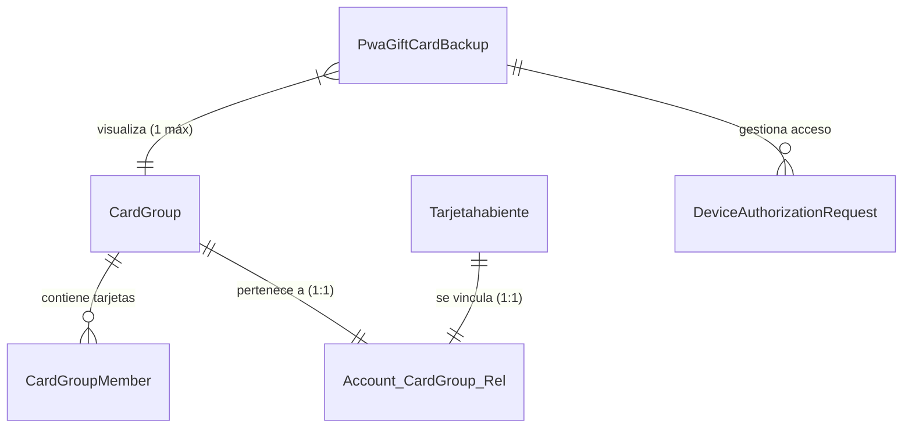

# Propuesta de Arquitectura: Grupos de Tarjetas para PWA (V2)

## Resumen
Arquitectura actualizada para la gestión de tarjetas en PWA, incorporando **reglas de negocio estrictas** y un **flujo de seguridad por autorización de dispositivos**.

## Reglas de Negocio (Actualizadas)
1.  **Unicidad PWA**: Una PWA (Dispositivo) solo puede estar visualizando **un solo Grupo de Tarjetas** a la vez.
2.  **Unicidad Usuario**: Un Usuario (Tarjetahabiente) solo puede ser dueño de **un solo Grupo de Tarjetas**.
3.  **Seguridad**: Para migrar un grupo a un nuevo dispositivo (PWA), el dispositivo anterior (Master) debe autorizar la operación.

---

## Diagramas de Arquitectura

### 1. Vista General

### 2. Tablas Principales

#### `CardGroup`
El contenedor central.
*   `id`: PK
*   `uuid`: Identificador único público.

#### `PwaGiftCardBackup` (La PWA)
Ahora contiene referencia directa al grupo activo.
*   `id`: PK
*   `device_id`: Huella del dispositivo.
*   `card_group_id`: FK hacia `CardGroup`. (Regla: 1 PWA -> 1 Grupo).
*   `is_master_device`: Booleano, indica si este dispositivo puede autorizar a otros.

#### `Account_CardGroup_Rel` (Vinculación Usuario)
Tabla 1:1.
*   `th_id`: FK Usuario.
*   `card_group_id`: FK Grupo.

#### `DeviceAuthorizationRequest` (NUEVO: Seguridad)
Maneja el flujo de "Pedir permiso al celular viejo".
*   `id`: PK
*   `card_group_id`: El grupo que se quiere “robar” o “clonar”.
*   `requesting_pwa_id`: El nuevo dispositivo.
*   `authorizing_pwa_id`: El dispositivo anterior (que debe aprobar).
*   `status`: 'PENDING', 'APPROVED', 'DENIED'.
*   `token`: Token para validar la acción.
*   `expires_at`: Ventana de tiempo para autorizar (ej. 15 min).

---

## Flujos Críticos

### A. Agregar Tarjeta en Dispositivo Nuevo
1.  Usuario escanea QR o abre link de tarjeta.
2.  Sistema detecta que la PWA no tiene grupo.
3.  Sistema detecta que la Tarjeta YA pertenece a un Grupo (`Grupo A`).
4.  **Bloqueo**: No se puede mostrar el grupo inmediatamente.
5.  **Solicitud**: Se crea `DeviceAuthorizationRequest` para el `Grupo A`.
6.  **Notificación**: Se notifica a la PWA que tiene el `Grupo A` activo (Authorizing PWA).
7.  **Acción**: Usuario en dispositivo viejo da "Aprobar".
8.  **Resultado**: El Dispositivo Nuevo actualiza su `card_group_id` a `Grupo A`.

### B. Usuario Registrado y PWA
1.  Usuario hace login.
2.  Sistema busca su Grupo único en `Account_CardGroup_Rel`.
3.  La PWA actual se actualiza para apuntar a ese Grupo.
