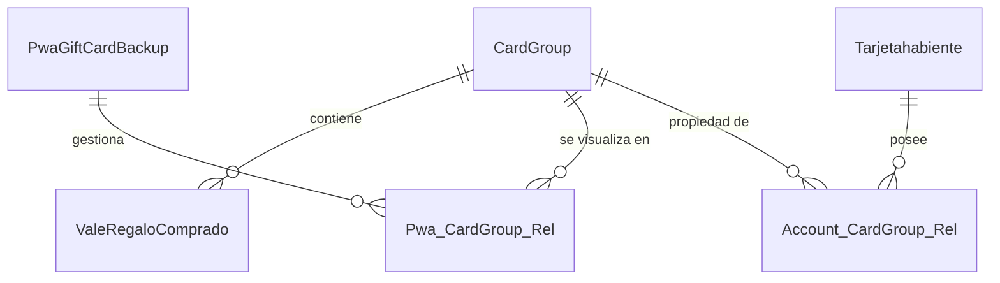
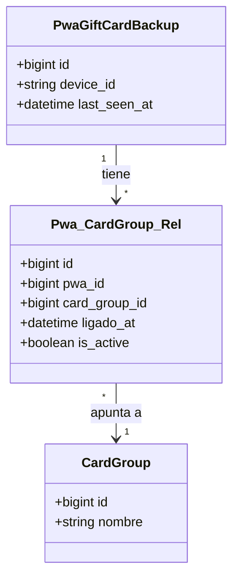
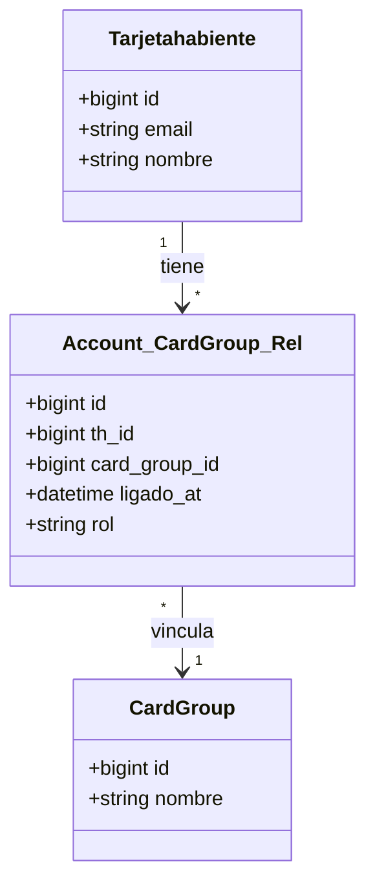
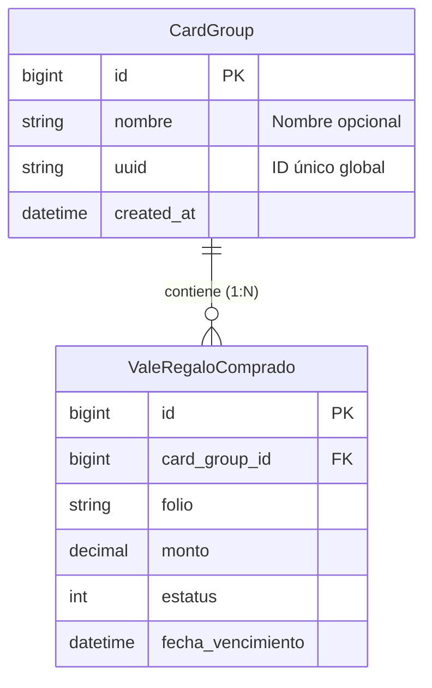

# Propuesta de Arquitectura: Grupos de Tarjetas para PWA

## Resumen
Esta propuesta describe una nueva arquitectura para la gestión de tarjetas de regalo en la PWA, desacoplando la identidad del dispositivo (PWA) de la identidad del usuario (Cuenta Social). Se introduce el concepto de **Grupo de Tarjetas** (`CardGroup`) como entidad central.

## Problema Actual
Actualmente, existe una relación directa o confusa entre los respaldos de PWA y los usuarios, lo que complica escenarios como:
*   Usuarios anónimos (sin cuenta) que quieren guardar tarjetas.
*   Usuarios que cambian de dispositivo y quieren recuperar sus tarjetas fácilmente.
*   Usuarios con múltiples dispositivos.

## Solución Propuesta: "Card Groups"
Crear una entidad intermedia `CardGroup` que agrupa las tarjetas.
*   **La PWA (Dispositivo)** se conecta a un Grupo.
*   **El Usuario (Cuenta)** reclama la propiedad de un Grupo.
*   Las tarjetas pertenecen al Grupo, no al usuario ni al dispositivo directamente.

---

## Diagramas de Arquitectura

### 1. Vista General
Muestra las entidades principales y sus relaciones de alto nivel.

### 2. Detalle: Conexión PWA (Dispositivo)
Cómo un dispositivo físico (móvil/desktop) accede a las tarjetas. Puede haber múltiples dispositivos viendo el mismo grupo.

### 3. Detalle: Conexión Usuario (Cuenta)
Cómo un usuario registrado toma posesión de un grupo. Esto habilita beneficios, recuperación en nuevos dispositivos y seguridad.

### 4. Detalle: Estructura del Grupo
La relación entre el grupo y las tarjetas individuales (`ValeRegaloComprado`).

---

## Beneficios Principales
1.  **Flexibilidad**: Permite uso anónimo inmediato (creando un Grupo sin dueño) y registro posterior (asignando dueño al Grupo).
2.  **Multidispositivo**: Un usuario puede escanear un QR en otro dispositivo y "sincronizar" el grupo fácilmente.
3.  **Simplicidad**: La lógica de negocio (vencimientos, saldos) se mantiene en `ValeRegaloComprado`, pero la agrupación se gestiona limpiamente en `CardGroup`.
