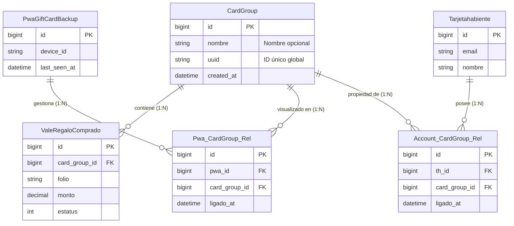

# Diagrama Entidad-Relación: Arquitectura "Grupo de Tarjetas"

> [!TIP]
> **Para ver mejor el diagrama:**
> 1. Abre este archivo (`pwa_group_er_diagram.md`) en tu editor de código (VS Code).
> 2. Haz clic derecho en la pestaña del archivo y selecciona **"Open Preview"** (o presiona `Ctrl + K, V`).
> 3. En la vista previa, puedes usar el zoom del editor (`Ctrl + +`) para ampliar la imagen tanto como necesites.
> 4. Si usas una extensión de Mermaid, puedes hacer clic derecho en el diagrama para guardar la imagen en alta resolución.

Este diagrama representa el modelo de datos basado en "Grupos de Tarjetas", desacoplando la PWA y la Cuenta de Usuario para permitir una gestión flexible de las tarjetas.

## Conceptos Clave
1.  **GrupoTarjetas (CardGroup)**: Es el núcleo del sistema. Las tarjetas pertenecen a un grupo, no directamente a un usuario o dispositivo.
2.  **Independencia**: Un `GrupoTarjetas` puede existir sin estar ligado a una cuenta (usuario anónimo en PWA) o sin estar en una PWA (usuario web).
3.  **Vinculación Flexible**:
    *   **PWA -> Grupo**: Un dispositivo PWA se conecta a un grupo para mostrar las tarjetas en la billetera.
    *   **Cuenta -> Grupo**: Un usuario registrado se conecta a un grupo para reclamar la propiedad y beneficios.

## Diagrama ER

## Flujos de Ejemplo

### Caso A: Usuario Nuevo (Sin Cuenta, Solo PWA)
1.  Usuario abre link de tarjeta.
2.  Sistema detecta que no tiene `CardGroup`.
3.  Se crea `CardGroup` nuevo.
4.  Se crea `PwaGiftCardBackup` (si no existe) para su dispositivo.
5.  Se inserta en `Pwa_CardGroup_Rel` (`pwa_id`, `group_id`).
6.  La tarjeta (`ValeRegaloComprado`) se asigna al `card_group_id`.

### Caso B: Usuario Registrado (Login)
1.  Usuario hace login en PWA.
2.  Sistema busca `Account_CardGroup_Rel` para su `th_id`.
3.  **Si tiene Grupo**:
    *   Se actualiza `Pwa_CardGroup_Rel` para apuntar a ese grupo existente.
    *   Las tarjetas del grupo anterior (anónimo) podrían fusionarse o moverse al grupo de la cuenta.
4.  **Si no tiene Grupo**:
    *   Se crea `Account_CardGroup_Rel` vinculando su cuenta al grupo actual de la PWA.

### Validación de Beneficios
Cuando se usa una tarjeta desde la PWA:
1.  Se obtiene el `CardGroup` activo.
2.  Se consulta si existe un registro en `Account_CardGroup_Rel` para este grupo.
3.  Si existe -> **Aplicar Descuentos/Beneficios de Socio**.
4.  Si no existe -> **Cobro Estándar**.
