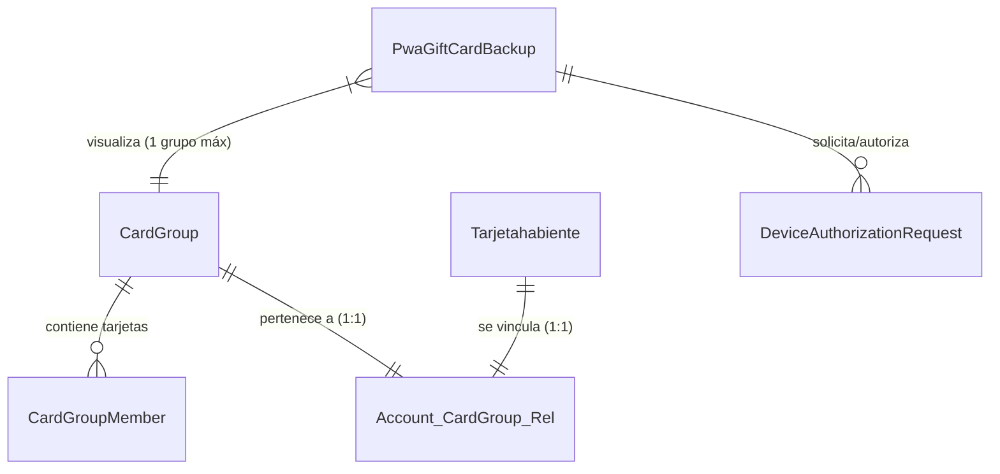
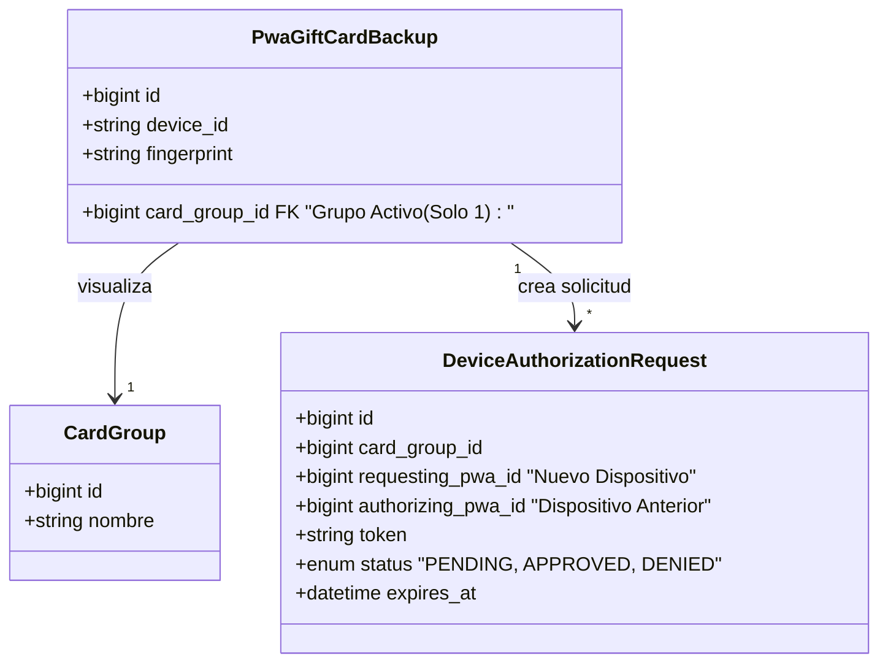
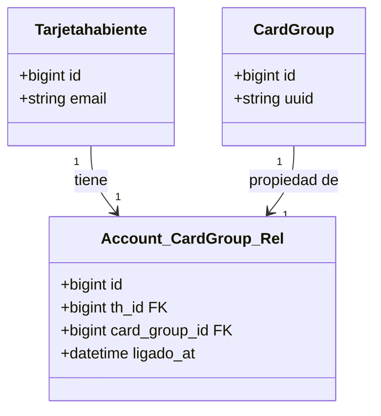
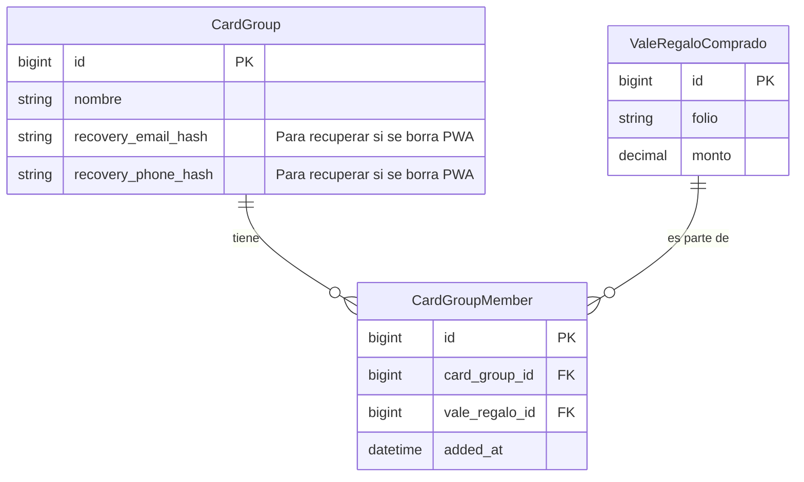

# Diagramas ER Enfocados: Arquitectura "Grupo de Tarjetas" (V2)

Diagramas actualizados según reglas de negocio estrictas:
1.  **1 PWA = 1 Grupo**.
2.  **1 Usuario = 1 Grupo**.
3.  **Flujo de Autorización entre Dispositivos**.

## 1. Vista General (Simplificada)

---

## 2. Detalle: PWA y Autorización
Muestra que una PWA solo puede tener un Grupo activo y el mecanismo de seguridad para cambiar de dispositivo.

---

## 3. Detalle: Usuario y Grupo (Relación 1 a 1)
Regla estricta: Un usuario solo puede tener un grupo ligado.

---

## 4. Detalle: Miembros del Grupo
Relación entre las tarjetas y el grupo. Se usa una tabla intermedia `CardGroupMember` para flexibilidad.

