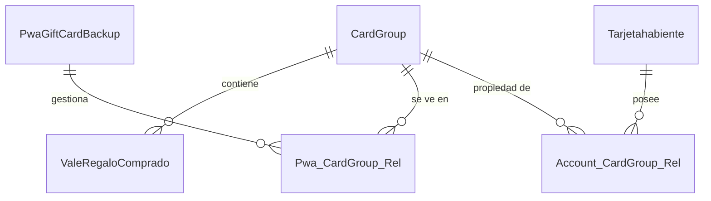
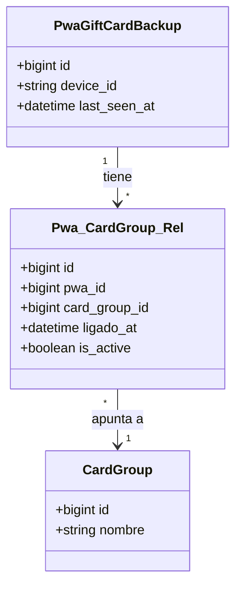
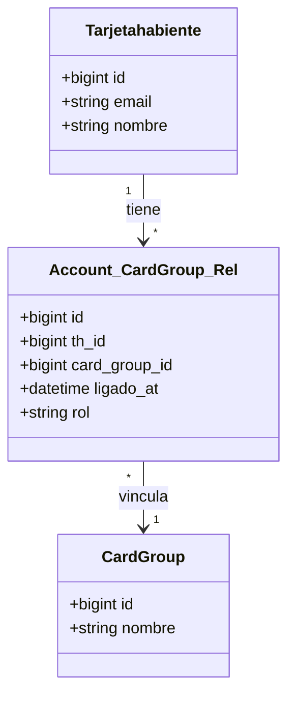
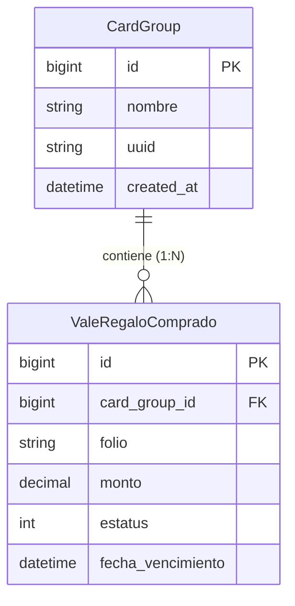

# Diagramas ER Enfocados: Arquitectura "Grupo de Tarjetas"

Para facilitar la lectura, he dividido el diagrama en partes más pequeñas y específicas.

## 1. Vista General (Simplificada)
Muestra solo las entidades principales y cómo se conectan. Ideal para entender la arquitectura a grandes rasgos.

---

## 2. Detalle: Lado PWA (Dispositivo)
Enfocado en cómo el dispositivo (PWA) se conecta al Grupo de Tarjetas.

---

## 3. Detalle: Lado Cuenta (Usuario)
Enfocado en cómo el usuario registrado se conecta al Grupo de Tarjetas para reclamar propiedad.

---

## 4. Detalle: Grupo y sus Tarjetas
Muestra la estructura interna del Grupo y las Tarjetas que contiene.

