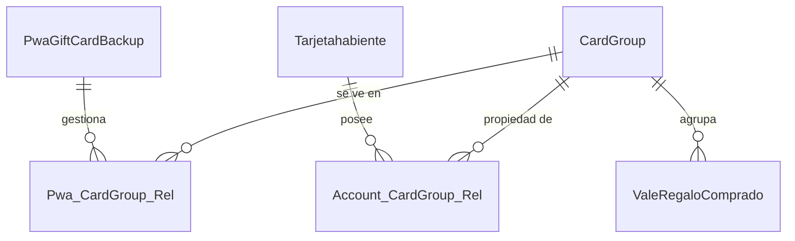

# Walkthrough: Diseño de Arquitectura PWA (Linkage & Grupos)

Este documento resume el proceso de diseño y los artefactos generados para la nueva arquitectura de vinculación de tarjetas de regalo en la PWA.

## Objetivo
Diseñar un modelo de Entidad-Relación (ER) que soporte el flujo de "Agregar Tarjeta a PWA", permitiendo flexibilidad en la gestión de usuarios (anónimos vs registrados) y dispositivos.

## Proceso de Diseño

### 1. Análisis Inicial
Se inspeccionaron los modelos existentes:
*   `ValeRegaloComprado`: Representa la tarjeta individual.
*   `PwaGiftCardBackup`: Representa el estado en el dispositivo.

### 2. Refinamiento (Feedback de Audio)
Basado en las instrucciones de audio, se introdujo el concepto de **Grupo de Tarjetas (`CardGroup`)**.
*   **Antes**: La PWA contenía directamente las tarjetas.
*   **Ahora**: La PWA se conecta a un `CardGroup`. El Usuario se conecta al mismo `CardGroup`. Las tarjetas pertenecen al Grupo.

### 3. Artefactos Generados

| Archivo | Descripción | Uso |
| :--- | :--- | :--- |
| `propuesta_arquitectura_pwa.md` | **Documento Principal**. Propuesta formal con diagramas divididos y explicación de negocio. | **Para Enviar/Aprobar** |
| `pwa_group_er_diagram_focused.md` | Contiene los diagramas divididos (Vista General, PWA, Cuenta, Detalle) para mejor lectura. | Referencia Visual |
| `pwa_group_er_diagram.md` | Diagrama técnico completo (versión monolítica). | Referencia Técnica |

## Diagrama de Alto Nivel
La arquitectura final se basa en la independencia de la PWA y la Cuenta, unidas por el Grupo:

## Próximos Pasos
1.  Revisar y aprobar `propuesta_arquitectura_pwa.md` con el equipo.
2.  Implementar las migraciones de base de datos para crear `card_groups` y las tablas pivote.
3.  Actualizar la lógica en los controladores para usar este nuevo flujo.
